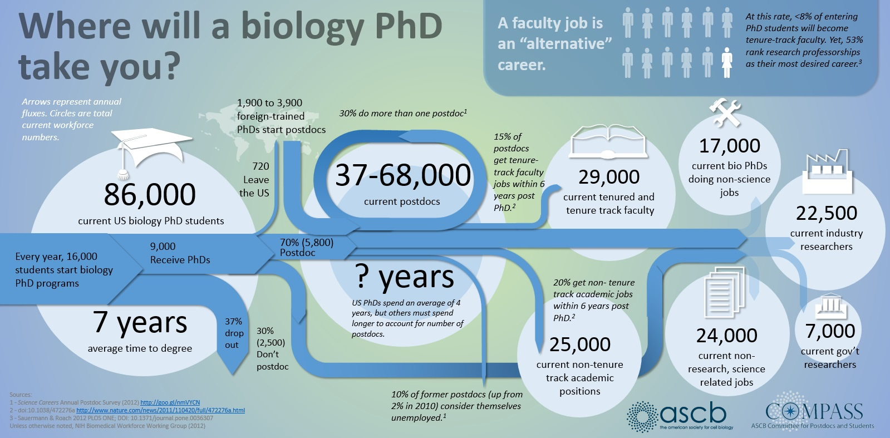

# Leaving Academia
building a runway to a career 
outside of the ivory tower

---

### About this talk

<ol>
<li class="fragment" data-fragment-index="0">Who is this person?</li>
<li class="fragment" data-fragment-index="1">Why leave?</li>
<li class="fragment" data-fragment-index="2">What options are there?</li>
<li class="fragment" data-fragment-index="3">How do I get out?</li>
</ol>

---

### Who is this person?

**Dr. David Dotson**, formerly of the *Beckstein Lab*
<ul>
<li class="fragment" data-fragment-index="0">performed simulations Na+/H+ antiporter proteins</li>
<li class="fragment" data-fragment-index="1">Linux nerd with an affinity for Python</li>
<li class="fragment" data-fragment-index="2">defended in November 2016, been working in Phoenix tech industry since</li>
</ul>

---

### Why leave?

<ol>
<li class="fragment" data-fragment-index="0">Few employment opportunities</li>
<li class="fragment" data-fragment-index="1">Hyper-competitive grant climate</li>
<li class="fragment" data-fragment-index="2">Stress/pay ratio too high</li>
</ol>

----

#### Academic jobs are an "alternative" career path

----

#### Grants are hard to come by

The success rate of grant applications by organization:

----

----
